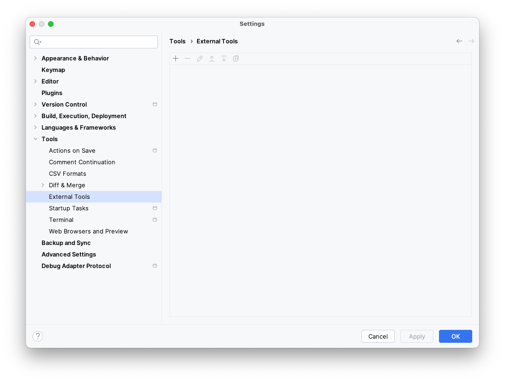
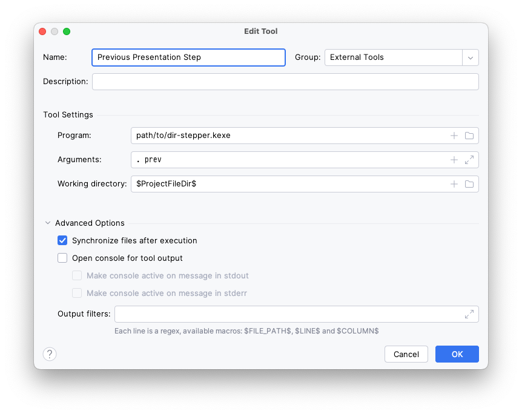
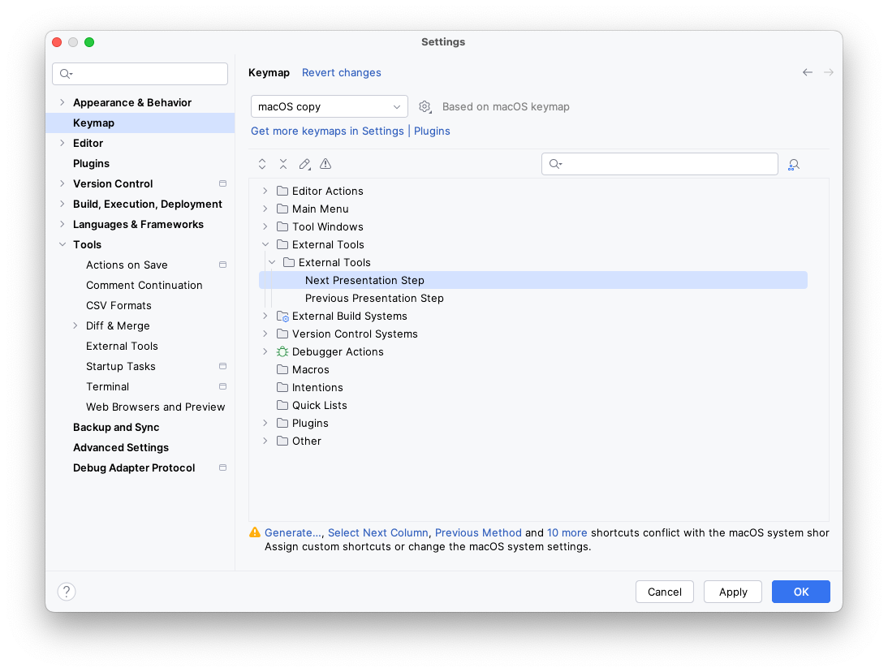
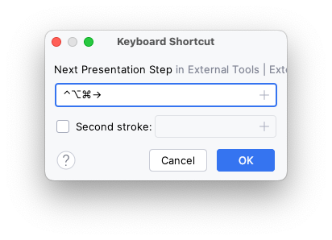
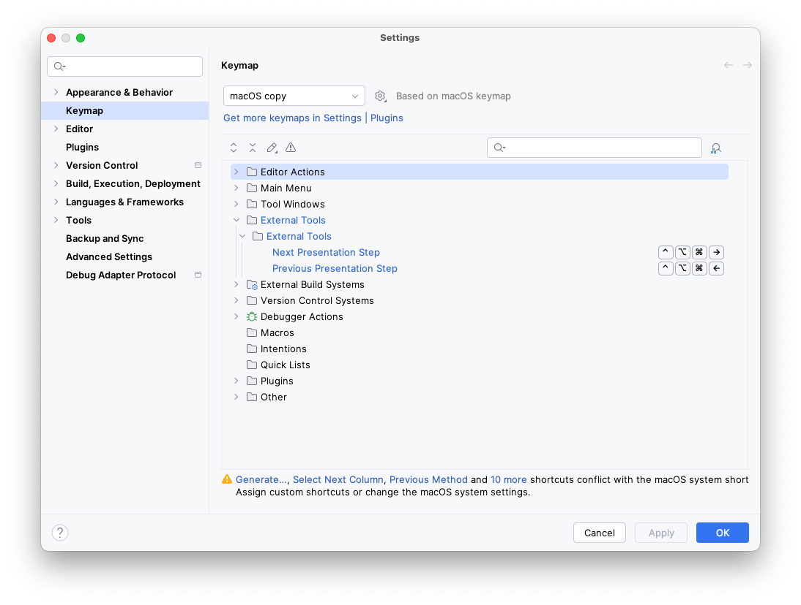

# Dir Stepper

Walk the files in a directory through a series of steps.
Useful for presentations.

https://github.com/user-attachments/assets/0a4e473f-ab8e-4058-b213-46e709a77d7f

# Usage

## Install

For now, build the binary yourself and put it somewhere…

## IDE setup

Visit <b>Settings > Tools > External Tools</b>.

Click <b>+</b> to add a new tool, and enter details for executing the binary to move to the next step.

Click <b>OK</b>, then <b>+</b> again to add a tool, and enter details for executing the binary to move to the previous step.

Click <b>Ok</b>.

Visit <b>Settings > Keymap</b> and expand the external tools section.
You might have to click <b>Ok</b> to save settings and then go back in before the tools added above show up.

Right-click the first tool, and select <b>Add keyboard shortcut</b>.
Press the desired key combination.

Click <b>OK</b>, and do the same for the second tool.

Click <b>OK</b> to save settings.

## Directory setup

By default, the tool assumes the steps live in a `.steps/` directory.
It also assumes a `.step.1` file exists.

Create as many numbered steps as you want with only the changed files to be applied.

https://github.com/user-attachments/assets/0a4e473f-ab8e-4058-b213-46e709a77d7f

# License

    Copyright 2026 Jake Wharton

    Licensed under the Apache License, Version 2.0 (the "License");
    you may not use this file except in compliance with the License.
    You may obtain a copy of the License at

       http://www.apache.org/licenses/LICENSE-2.0

    Unless required by applicable law or agreed to in writing, software
    distributed under the License is distributed on an "AS IS" BASIS,
    WITHOUT WARRANTIES OR CONDITIONS OF ANY KIND, either express or implied.
    See the License for the specific language governing permissions and
    limitations under the License.
